# Evidências

Aqui ficaram os principais prints do projeto Infernal Dungeon para facilitar a conferência.

## Repositório

```text
https://github.com/viniciusCecat/InfernalDungeon
```

## Vídeo de demonstração

Vídeo gravado para apresentar o funcionamento: [video-demonstracao.mp4](video-demonstracao.mp4)

## Telas da wiki

### 01. Tela inicial

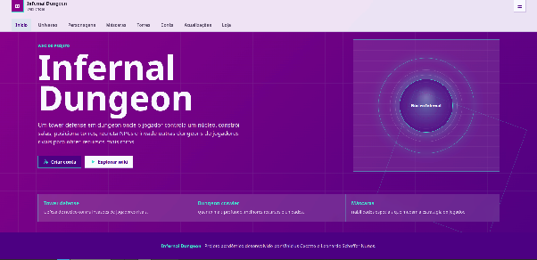

### 02. Universo e objetivo

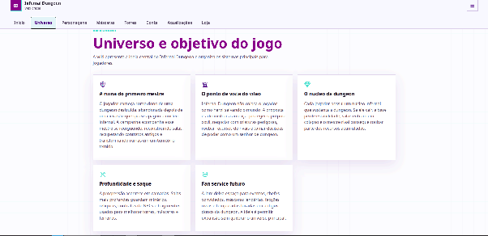

### 03. Elenco inicial

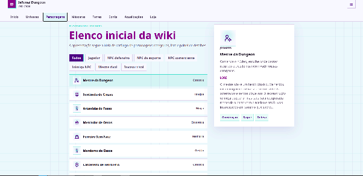

### 04. Máscaras e poderes

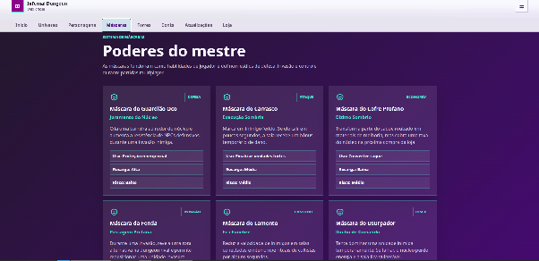

### 05. Torres infernais

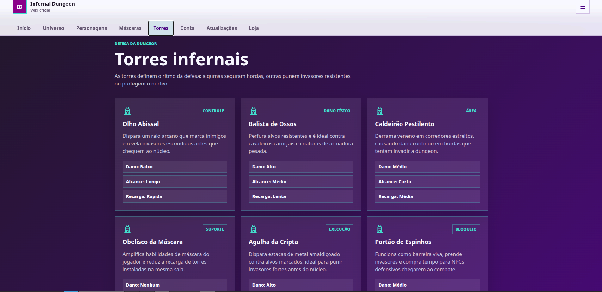

## Fluxo de conta

### 06. Registro

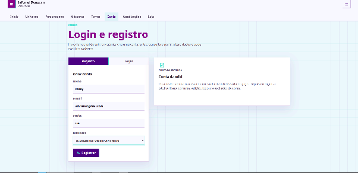

### 07. Login

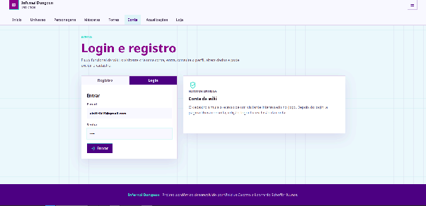

### 08. Perfil e edição

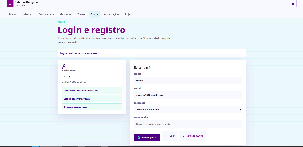

### 09. Suporte por e-mail

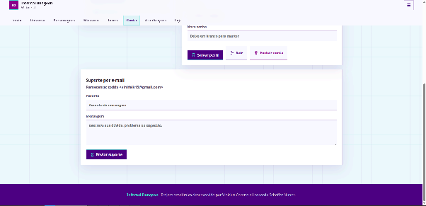

### 10. Confirmação de edição

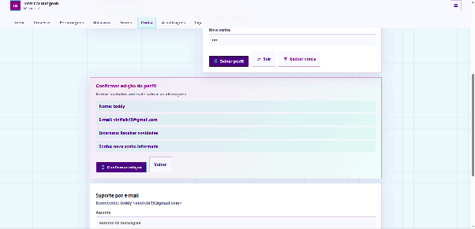

### 11. Confirmação de exclusão de conta


## Atualizações e loja

### 12. Atualizações e devlog


### 13. Endereço de entrega

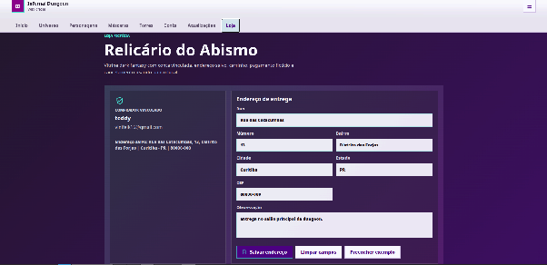

### 14. Produtos e carrinho vazio


### 15. Histórico de pedido

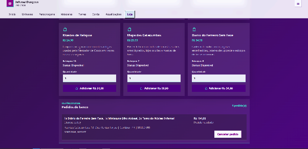

### 16. Carrinho com itens


### 17. Pagamento fictício


## Banco de dados

### 18. Banco no navegador


### 19. Tabelas e registros


