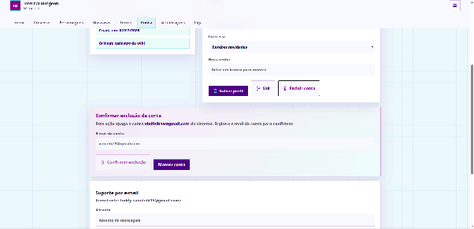
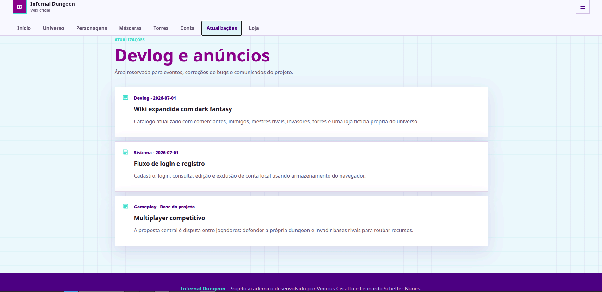
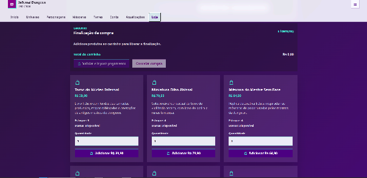
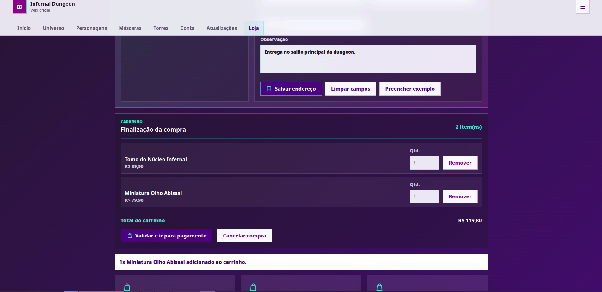
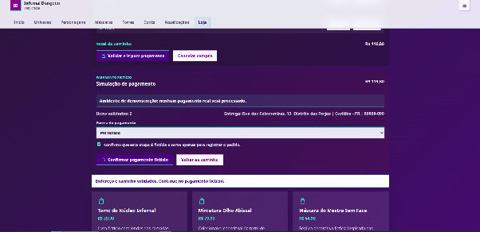
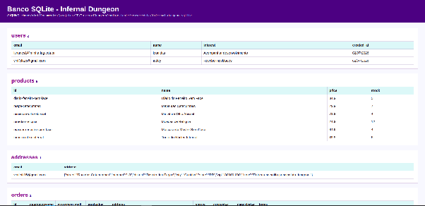
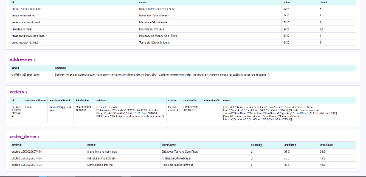

# Evidências

Este arquivo reúne as principais capturas de tela do projeto Infernal Dungeon.

## Repositório

```text
https://github.com/viniciusCecat/InfernalDungeon
```

## Vídeo de demonstração

Arquivo: [video-demonstracao.mp4](video-demonstracao.mp4)

## Telas da wiki

### 01. Tela inicial


### 02. Universo


### 03. Personagens


### 04. Máscaras


### 05. Torres


## Fluxo de conta

### 06. Registro


### 07. Login


### 08. Perfil


### 09. Confirmação do perfil


### 10. Edição de perfil


### 11. Exclusão de conta



## Atualizações e loja

### 12. Atualizações



### 13. Vitrine da loja


### 14. Endereço de entrega



### 15. Pagamento fictício


### 16. Pedido registrado



### 17. Cancelamento de pedido



## Banco de dados

### 18. Banco no navegador



### 19. Tabelas do banco


